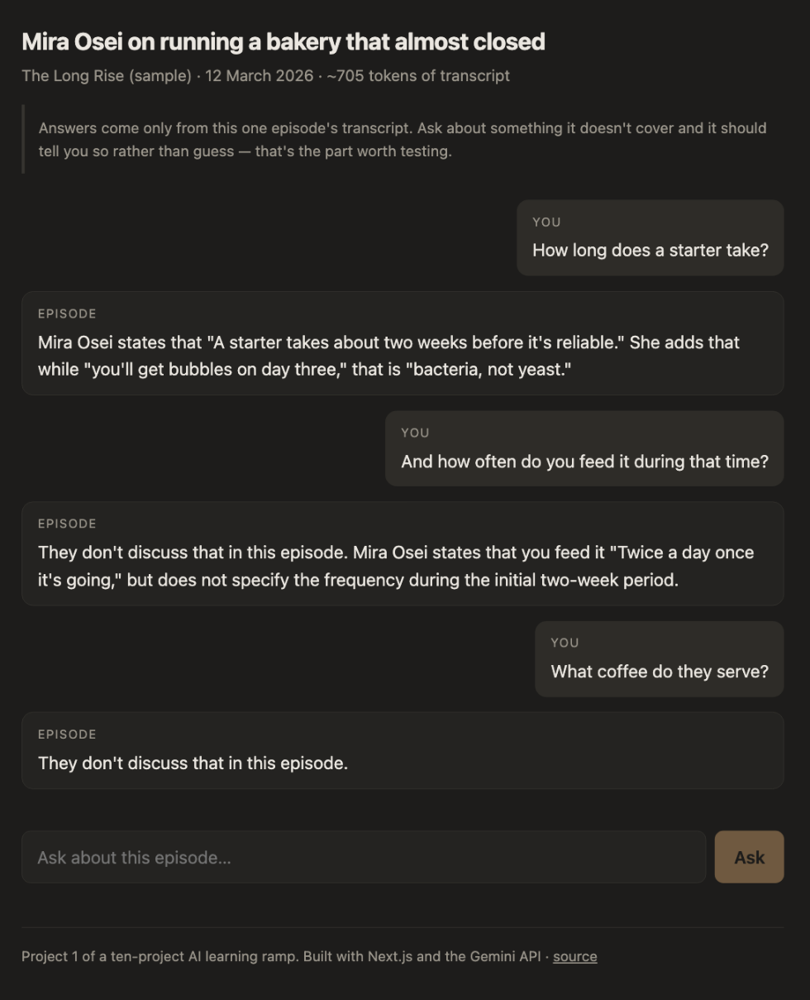
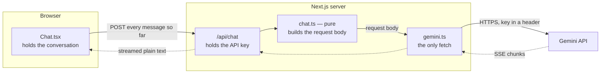
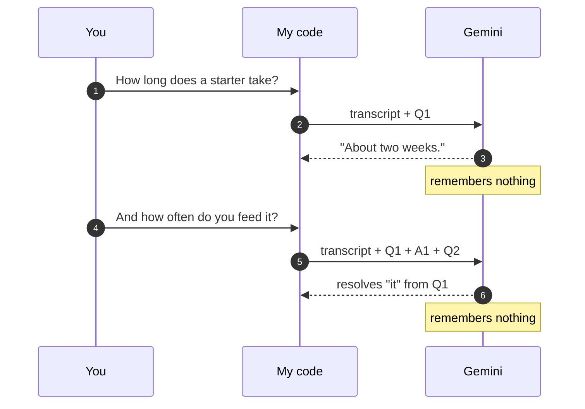
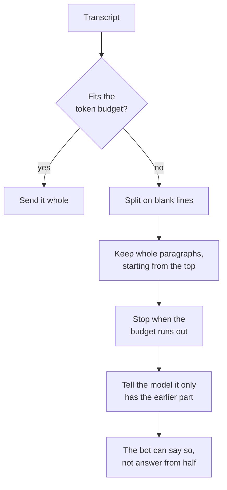

# Podcast Chatbot

> Ask questions about a podcast episode and get answers from its transcript — with the quote, not a plausible-sounding invention.

[](https://github.com/Nicklah/podcast-chatbot/actions/workflows/ci.yml)


<!-- TODO after deploying: paste the Vercel URL here. -->
**▶ Live demo: _not deployed yet_** · no login required

## Demo



Three questions, and each one is doing a different job:

1. **"How long does a starter take?"** → the answer comes back with the transcript quoted,
   not paraphrased.
2. **"And how often do you feed it during that time?"** → "it" is never named. It resolves,
   because the previous exchange was re-sent. And the answer splits a question the episode
   only half-covers — giving the fact it has, refusing the part it doesn't.
3. **"What coffee do they serve?"** → not in the episode. It says so instead of inventing
   something. That refusal is the feature; try to break it.

Real output from the sample episode, not a mockup.

---

## The problem

A good episode is an hour long and completely unsearchable. You remember the guest said
something useful about pricing, but finding it again means scrubbing through 60 minutes
of audio hoping to recognise it. Show notes are three bullet points. A transcript exists,
but nobody reads a 9,000-word wall of text.

The knowledge is technically public and practically lost.

## What it does

- **Answers questions about one episode**, grounded in that episode's transcript.
- **Follow-up questions work** — "what else did they say about it?" resolves against what
  you already asked.
- **Streams the answer** as it's generated, instead of showing a blank screen for eight
  seconds.
- **Admits when it doesn't know**, rather than filling the gap from general knowledge.

## How it works



The split is the main design decision. Everything that can be decided **without** a network
connection is decided in `chat.ts`, which is pure — no `fetch`, no key, no environment, no
clock. That's why the logic that matters has 23 tests and the file that touches the network
is 90 lines.

Two things I made sure I could explain out loud, because that was the actual goal of this
project:

### 1. The model has no memory. My code is the memory.



Gemini is stateless. On the second message I don't send "and how often do you feed it?" — I
send the transcript, *and* the first question, *and* the first answer, *and* the new
question, all over again. On the tenth message I send all ten. The entire conversation is
re-packed into every single call by [`buildRequest`](src/lib/chat.ts), which is why that
function has a test asserting exactly that.

Chat "memory" is a re-send, not a state the model keeps.

That has a cost: the request grows every turn, so `trimHistory` caps it at the last six
exchanges. Past that the bot genuinely forgets the start of the conversation — because I
stopped sending it.

### 2. What happens when the transcript is longer than the context window



Every model has a limit on how much text it will accept. `gemini-2.5-flash` takes about a
million tokens, so one episode fits many times over — but [`fitTranscript`](src/lib/chat.ts)
budgets it anyway, for two reasons that aren't hypothetical: the whole transcript is re-sent
on *every* message and input tokens are billed per request, and most other models are far
smaller.

Nothing is ever cut mid-sentence, and nothing is ever cut silently.

Keeping the *start* is an arguable choice: podcast intros establish who the guest is, and
losing that makes every later answer worse. The right fix isn't truncation at all — it's
retrieving only the relevant chunks, which is RAG, and which is a much later project.

### And one decision that isn't about the model at all

The `/api/chat` route exists so the API key stays on the server. If the browser called
Gemini directly, the key would ship in the JavaScript bundle and anyone could open devtools
and spend the quota. The variable is `GEMINI_API_KEY`, deliberately *without* a
`NEXT_PUBLIC_` prefix — that prefix is what would leak it.

## Tech stack

**TypeScript** (strict) · **Next.js 16** (App Router) · **Gemini API** via `fetch`, no SDK ·
**Vitest** · plain CSS · deploys to **Vercel**

> **Why no SDK:** calling the REST endpoint directly means the request body in
> `buildRequest` is literally what goes over the wire. For a project whose whole point was
> understanding what gets sent, a wrapper would have hidden the thing I was trying to learn.

## Testing

The code is split so the part that matters can be tested without a network or a key.

| File | What's tested |
|---|---|
| `src/lib/chat.ts` | Pure. The whole conversation is re-sent each turn, old turns get dropped, transcripts are truncated on paragraph boundaries, bad conversations are rejected, one SSE chunk parses. **23 tests.** |
| `src/lib/gemini.ts` | Against a fake `fetch`: streaming works, the key goes in a header and never the URL, a non-200 throws — and an SSE event split across two network chunks still arrives whole. **6 tests.** |
| `src/lib/grounding.ts` | The grading rules for the grounding check below — an invented answer to an unanswerable question must score as a failure. **10 tests.** |

```bash
npm test
```

The SSE one is the test I'd have missed by hand: a network chunk isn't a line, so the
stream can split `data: {"candidates"...` straight down the middle. It looks fine in
testing right up until it doesn't.

### Checking that it doesn't make things up

```bash
npm run check:grounding     # calls the real API, needs your key, costs a little quota
```

Seven questions written by hand against the sample episode: four that the episode answers,
and three it doesn't — including a phone number, and a leading question about franchise
plans that were never mentioned. The first four have to produce the fact; the last three
have to produce a refusal.

**Currently 7/7, stable across three runs** (`gemini-2.5-flash`, 1 Sep 2026).

This is skipped in CI on purpose, not by accident — CI has no key, and a check that costs
money shouldn't run on every push.

**What this is not:** it's keyword matching, so it catches an invented phone number and
would miss a subtly wrong summary. And it's a little flaky, because the model isn't
deterministic. That flakiness is worth paying attention to rather than papering over — a
check that passes 5 times out of 7 is telling you the prompt isn't reliable enough. The
grown-up version of this compares against hand-written correct answers and is called an
eval; it's the next thing I want to learn.

## Limitations

Real ones, not modesty:

- **One episode, hardcoded** in `src/data/episode.ts`. No library, no search across a feed.
- **Nothing is saved.** Refresh the page and the conversation is gone. No database, no
  accounts.
- **It forgets past six exchanges**, by design — see above.
- **Grounding is a prompt, not a guarantee.** The system prompt tells the model to answer
  only from the transcript and to refuse otherwise; nothing in the code enforces it.
  `npm run check:grounding` measures how often it holds — currently 7/7 — but by keyword
  matching, which is a smoke test rather than a real evaluation. Seven questions is also a
  very small sample to claim anything from.
- **No audio.** Transcript text in; transcription is a separate problem.

## Running locally

```bash
git clone https://github.com/Nicklah/podcast-chatbot
cd podcast-chatbot
npm install
cp .env.example .env.local     # then paste in your key
npm run dev
```

You need a Gemini API key — free at [aistudio.google.com/apikey](https://aistudio.google.com/apikey).
The free tier is plenty for this.

## Project layout

```
src/
  app/
    page.tsx            server component — reads the transcript, renders the header
    api/chat/route.ts   holds the key, validates input, streams the answer back
  components/
    Chat.tsx            client component — holds the conversation
  lib/
    chat.ts             PURE — the request body, history trimming, transcript fitting
    gemini.ts           the only file that calls fetch
    grounding.ts        the grounding check's questions and grading
  data/
    episode.ts          one episode: metadata + transcript
```

## Use your own podcast

Replace `src/data/episode.ts` with a transcript of a show you actually listen to and update
the `episode` details. Keep the blank line between paragraphs — that's what stops a long
transcript from being cut off mid-sentence. The questions in `src/lib/grounding.ts` and the
suggestion chips in `Chat.tsx` are written against the sample episode, so rewrite those too.

The sample episode in the repo is fictional. Nobody said any of it.

## Deploying

Push to GitHub, import the repo at [vercel.com/new](https://vercel.com/new), and add
`GEMINI_API_KEY` under Settings → Environment Variables. Then put the URL at the top of
this file.

## License

MIT
